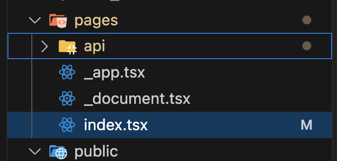
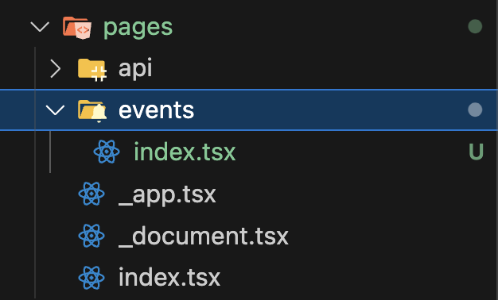
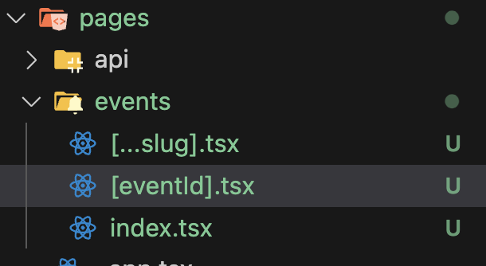
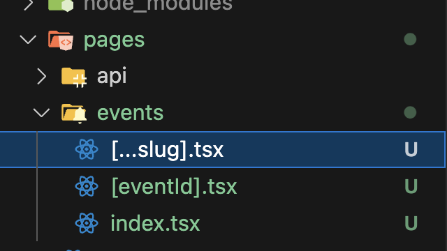

### 시작


<br />
pages folder의 index.tsx가 main page가 된다.

---

### 페이지 생성


<br />
새로운 폴더를 만들고 거기에 index.tsx를 만들면

`/폴더이름` 으로 접속 시, 그 폴더의 `index.tsx`가 렌더링 된다.

### dynamic route



`/폴더이름/아무거나` 적을 경우 해당 페이지로 이동



`/폴더이름/아무거나/****` 적을 경우 해당 페이지로 이동.
더 아래단계들까지 감지 가능

---

### 폴더 구조

- pages 폴더에 파일을 생성할 경우 Next.js에서 경로로 인식할 가능성이 있다.
- 그러므로 아예 분리된 폴더에 커스텀 컴포넌트를 생성하는 것이 권장된다.

### `useRouter()`

- app router와 달리 query를 조회할 때 useRouter 사용
- `router.query`로 조회

```jsx
import { useRouter } from "next/router";

function someComp() {
  const router = useRouter();
  console.log(router.query); // dynamic route id, query parameter 모두 조회가능
}
```
