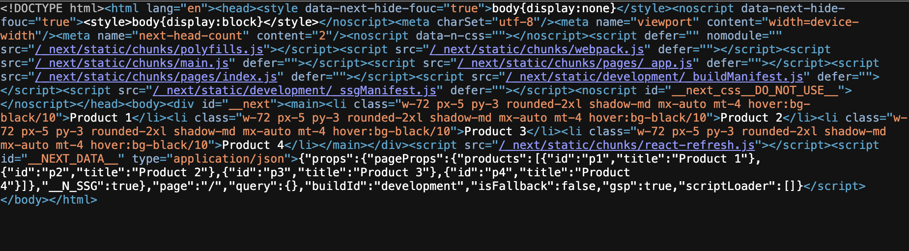

### Pre-fetching

- next.js는 기본적으로 prefetching 진행
- 페이지 소스에 DOM NODE 확인 가능

---

### `getStaticProps()`

- build 타임에 next.js가 prefetching 해야하는 페이지임을 명시.
- build 타임에 한 번 실행됨.

```jsx
export async function getStaticProps() {
  return {
    props: {
      products: [{ id: "p1", title: "Product 1" }],
    },
  };
}
```

- 페이지 렌더링 시 위 함수가 먼저 실행됨.
- 그리고 생성된 props를 컴포넌트에 props로 전달.

```jsx
function Home(props) {...생략}
```



---

### ISR

- Incremental Static Generation
- 특정 시간을 기점으로 새로 생성된 페이지를 제공
- getStaticProps를 사용하면 build 시 한번 실행되지만, `revalidate` 프로퍼티를 추가하면 설정한 주기마다 재생성됨.

```jsx
export async function getStaticProps() {
  return {
    props: {
      products: [{ id: "p1", title: "Product 1" }],
    },
    revalidate: 10, // 10초 지나면 페이지 재생성
  };
}
```

---

### SSR의 dynamic routing

- getStaticProps를 사용한 페이지에는 `getStaticPaths()` 사용 필요
- `getStaticPaths()`가 리턴하는 경로를 정적으로 미리 생성한다.

```jsx
export async function getStaticPaths() {
  return {
    paths: [
      { params: { productId: "p1" } },
      { params: { productId: "p2" } },
      { params: { productId: "p3" } },
    ],
    fallback: false,
  };
}
```

---

### `getStaticPaths()`의 `fallback`옵션

- `false` : `getStaticPaths()`에서 지정하지 않은 경로는 404 return
- `true`
  - 지정한 경로는 `getStaticProps()`에 의해 HTML로 렌더링됨.
  - 생성되지 않은 경로는 'fallback' 버전을 제공
- `blocking`
  - getStaticPaths가 return하지 않은 새 path는 SSR과 동일하게 HTML이 생성될 때까지 기다린 다음 이후 요청을 위해 캐시되어 path당 한 번만 발생한다.
  - fallback 컴포넌트를 보여주지 않음.
  - 비교적 생성속도가 빠를때는 blocking을 사용하는 것이 좋음

---

### `getServerSideProps()`

- getStaticProps는 이미 완성된 페이지를 pre-rendering 하는 것.
- 즉, client 요청에 대해 업데이트 할 수 없다.
- 이 때 사용함.
- 매 요청마다 서버에서 샐행되고 새로운 데이터를 가져와 페이지를 생성함.

```jsx
export const getServerSideProps = (context: GetServerSidePropsContext) => {
  const { params, req, res } = context;

  return {
    props: {
      userName: "Kim",
    },
  };
};
```

- `getServerSideProps()`는 Paths함수 사용할 필요 없음

---
